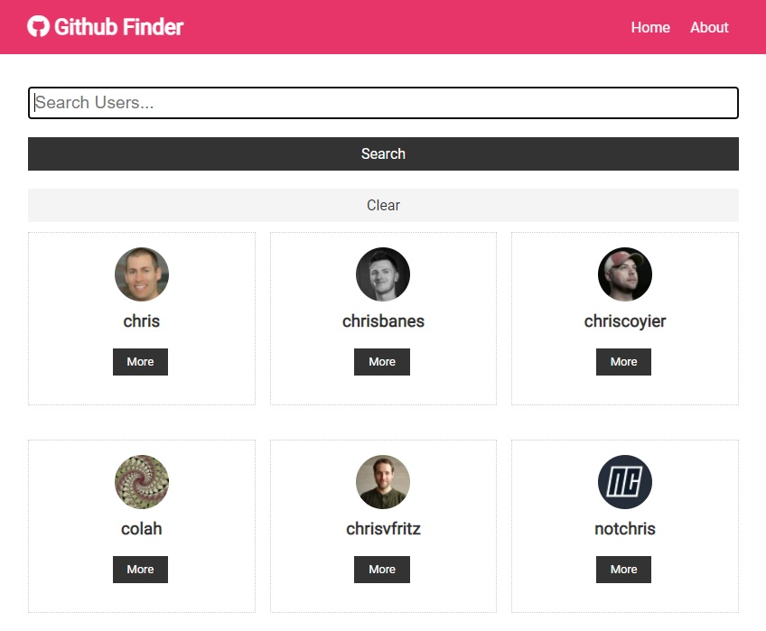

# Github Finder

Simple application for searching Github profiles. 

## Technology

React application built with Context API, useContext and useReducer hooks for state management. 

### Setup

To run this project, install it locally using npm:
```
$ npm install
$ npm start
```
Runs the app in the development mode.
Open [http://localhost:3000](http://localhost:3000) to view it in the browser.

### `npm run build`

Builds the app for production to the `build` folder.

### Source

Built during "Modern React Front To Back" course by [Brad Traversy](https://www.traversymedia.com/)
